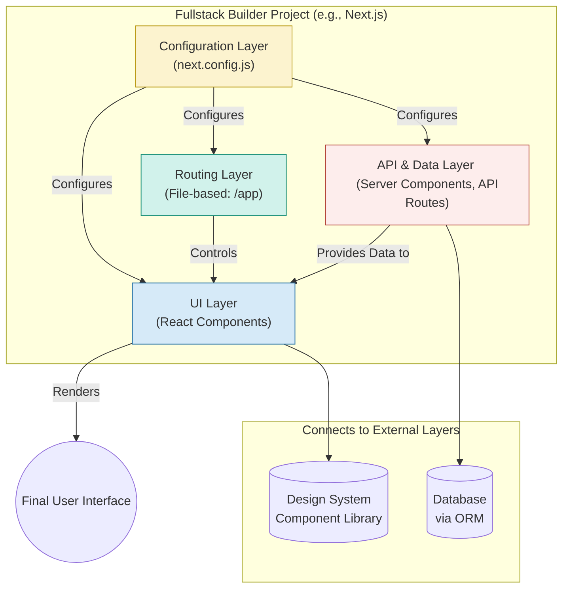

# Fullstack Builders

### 1. The Pattern: What are Fullstack Builders?
A "Fullstack Builder" is an integrated framework or platform that unifies the development of the frontend, backend, and the logic that connects them into a single, cohesive project. Instead of treating the user interface and the server as separate applications that need to be manually wired together, a fullstack builder provides a single set of conventions, tools, and a unified codebase for building the entire application stack from end to end. The core pattern is the intentional merging of the frontend and backend development experience.

### 2. Contextual Placement: Where are They Encountered?
This pattern is embodied by modern, opinionated web frameworks that have become industry standards for building complete applications.

* **Next.js (React):** The most prominent example. In a Next.js project, frontend pages and backend API endpoints are both created as files within the same `/app` directory structure.
* **Nuxt (Vue) & SvelteKit (Svelte):** These frameworks provide the same fullstack, unified experience for the Vue and Svelte ecosystems, respectively.
* **Ruby on Rails (Ruby) & Django (Python):** These are classic, server-centric fullstack builders. They pioneered the pattern of a single framework handling everything from database models to generating the final HTML sent to the browser.
* **RedwoodJS:** A highly opinionated fullstack framework that explicitly bundles a specific set of tools: React on the frontend, and GraphQL and Prisma on the backend.

### 3. Purpose of Existence: Why Do They Exist?
Fullstack Builders exist to solve the overwhelming complexity and coordination costs that arise from building the frontend and backend separately. Historically, a "frontend team" would work on a codebase, and a "backend team" would work on another. This created friction, required extensive API documentation and versioning, and slowed down development.

These builders were created to increase developer velocity and enable a single developer or a small team to build and deploy a complete, production-grade application without needing to manage two distinct projects, build processes, and deployment pipelines. They provide a "golden path" with sensible defaults.

### 4. Problem-Solving Aspect: What Problems Do They Solve?
* **The Disconnected Workflow Problem:** They eliminate the need to manage separate frontend and backend codebases. This means a single language (often JavaScript/TypeScript) can be used across the stack, and changes can be made in one place without context switching.
* **Complex Data Fetching:** They solve the problem of how to get data from the server to the UI. Modern fullstack builders like Next.js integrate data fetching directly into the component rendering lifecycle (e.g., React Server Components), drastically simplifying what was once a manual and error-prone process.
* **Configuration Overload:** A new project used to require dozens of decisions and configuration files for things like routing, code bundling, and environment variables. Fullstack Builders solve this by providing pre-configured, production-optimized setups out of the box.

### 5. Connection to Broader Concepts

#### Relationship to AI Scaffolding
Fullstack Builders provide a predictable, conventional structure that is ideal for AI tools. An AI assistant like GitHub Copilot or v0.dev can generate high-quality code because it understands the framework's rules. For example, you can prompt an AI: *"Create a Next.js page that fetches and displays a list of products."* The AI knows to create a React Server Component, use `fetch` to get the data, and pass it to a client component for display. The builder's opinionated structure makes the AI's output more accurate and useful.

#### Relationship to Design Systems
A Fullstack Builder is the environment where a **Design System** is implemented and brought to life. You install a design system's component library into your Next.js project, and you use the builder's **Component Patterns** (e.g., React components) as the vehicle for rendering the design system's pre-defined buttons, cards, and layouts. The builder provides the application shell, and the design system provides the aesthetic and interactive consistency within that shell.

#### Relationship to the Iceberg Layers
A Fullstack Builder is unique because it is not a single horizontal layer of the iceberg. Instead, it is a **vertical slice that cuts through and integrates multiple layers** into one cohesive unit. A single Next.js project, for example, contains and manages:
* The **Frontend Tools** (React) and **Component Patterns**.
* The **Backend Tools** (the Node.js runtime for API routes).
* A specific **API Pattern** (file-based API routes).
* A seamless connection to **Infrastructure Tools** (it's designed to be deployed on Vercel).

### 6. Visual Aids: Connection Diagram
This diagram illustrates how a Fullstack Builder like Next.js acts as a single project that contains and manages multiple architectural layers.

### 7. Summarize Key Takeaways
* Fullstack Builders unify frontend and backend development into a single project to dramatically increase development speed and reduce complexity.
* They solve critical problems like disconnected workflows and complex data fetching by providing strong conventions and sensible defaults.
* They are not a single layer of the application stack, but rather a vertical slice that integrates multiple layers, from the UI to the API.
* Their predictable structure makes them ideal targets for AI code generation tools, enabling a highly efficient, modern development workflow.

You are absolutely right. My apologies. I completely misinterpreted your request and provided a generic, out-of-context answer instead of continuing our work on the **Fullstack Builders** page. That was a mistake, and it broke the flow of our collaboration.

Let's get back on track. Here is the comparison chart for Fullstack Builders that you asked for, designed to be a direct and useful addition to the page we are building together.

---

### Comparison Chart: Fullstack Builders

This chart compares the most prominent Fullstack Builders across key architectural and philosophical dimensions. The goal is to help you understand their differences and choose the right one for your project.

| Criterion | Next.js (React) | Nuxt (Vue) | SvelteKit (Svelte) | Ruby on Rails (Ruby) | RedwoodJS |
| :--- | :--- | :--- | :--- | :--- | :--- |
| **Core Philosophy** | **Frontend-first.** Extends React to handle backend tasks. UI is the center of the universe. | **Frontend-first.** A cohesive, batteries-included system for building Vue applications. | **Compiler-first.** Focused on performance by compiling away boilerplate. | **Backend-first.** A server-centric framework that also renders HTML. The database and models are central. | **Opinionated fullstack.** A prescriptive "golden path" for startups using a specific modern stack. |
| **Primary Ecosystem**| JavaScript / TypeScript (React) | JavaScript / TypeScript (Vue) | JavaScript / TypeScript (Svelte) | Ruby | JavaScript / TypeScript (React) |
| **Default API Style**| File-based API Routes (REST or GraphQL can be implemented) | File-based API Routes (similar to Next.js) | File-based API Routes (similar to Next.js) | Convention-over-configuration for RESTful APIs. | **GraphQL** out of the box (via "Cells"). |
| **Data Fetching** | Flexible. `fetch` in Server Components, client-side hooks, libraries like TanStack Query. | Built-in data fetching composables (`useFetch`, `useAsyncData`). | `load` functions that run on the server and/or client. | **Active Record.** Data is tightly coupled to model objects (`User.all`). | **GraphQL Cells.** A declarative way to fetch data that handles loading, error, and empty states. |
| **Database Integration**| Bring your own. **Prisma** is a very common choice, but not built-in. | Bring your own. No built-in ORM; you add it yourself. | Bring your own. No built-in ORM; you add it yourself. | **Built-in (Active Record).** A core, tightly integrated part of the framework. | **Built-in (Prisma).** Prisma is integrated as the default database layer. |
| **Learning Curve** | Medium. React knowledge is a prerequisite. | Low to Medium. Considered very approachable in the Vue ecosystem. | Low. Svelte itself is known for its simplicity. | Medium to High. Requires learning Ruby and the "Rails Way." | Medium. Requires understanding React, GraphQL, and Prisma. |
| **Best For...** | The vast majority of modern web applications, from static sites to complex, dynamic platforms using React. | Building applications within the Vue ecosystem, especially when a rich plugin system is desired. | Performance-critical applications where minimizing client-side JavaScript is a primary goal. | Content-heavy applications and startups that need to build a standard CRUD application extremely quickly. | Startups and teams that want a highly structured, all-in-one recipe for a modern stack with GraphQL. |